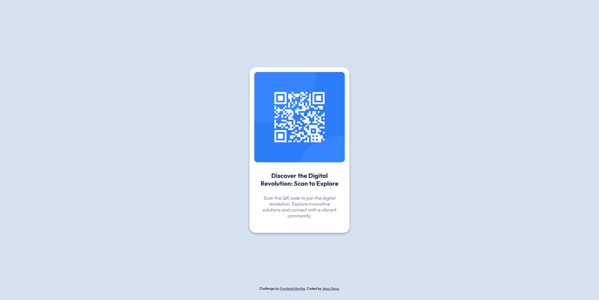

# QR Code Component

## Welcome! 👋

This project is a QR Code component implementation as part of a challenge proposed by Frontend Mentor. The component displays a QR Code and provides information about the Frontend Mentor platform. With a responsive design and an intuitive user experience, users can scan the code to access the website and enhance their coding skills. The project utilizes HTML, CSS, and modern front-end techniques to create an elegant and functional solution. It is an exciting opportunity to improve development skills and deepen knowledge in creating interactive components.

## Table of contents

- [Overview](#overview)
  - [Features](#features)
  - [Screenshot](#screenshot)
- [My Process](#my-process)
  - [Built with](#built-with)
  - [What I Learned](#what-i-learned)

## Overview

## Features

- Interactive QR Code display.
- Redirection to the Frontend Mentor website when scanning the code.
- Responsive design adaptable to different devices.

### Screenshot

## My process

### Built with

- Semantic HTML5 markup
- CSS custom properties
- Flexbox
- CSS Grid
- Mobile-first workflow

### What I learned

During the development of this project, I had the opportunity to learn and reinforce several key concepts and skills. Here are some of the things I learned:

- Implementation of a QR Code component using HTML and CSS.
- Understanding the principles of responsive design and creating a mobile-friendly layout.
- Utilizing background images and adjusting their properties, such as size and border radius.
- Applying styles to different elements using classes and selectors.
- Integrating external fonts into the project using Google Fonts.
- Creating a visually appealing and user-friendly UI through proper spacing, typography, and color choices.
- Gaining familiarity with the process of setting up a basic project structure and organizing files.
- Improving my understanding of version control by utilizing Git and committing changes.
